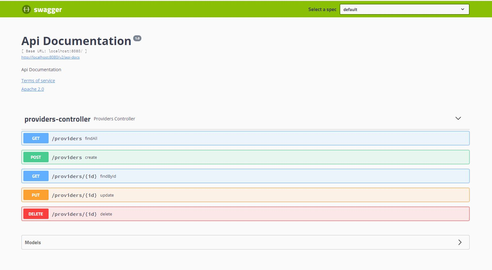

## Ejemplo de microservicio con Spring Boot 

Versión de Spring Boot: 2.4.4


Requisitos:

- Maven (instalado y configurado)
- mongoDB Server (instalado y arrancado, en localhost y con el puerto por defecto)


Construcción con maven:

```
mvn clean package
```

Arranque con plugin de maven:

```
mvn spring-boot:run
```
- API REST
  - http://localhost:8080/providers

- Spring Boot Actuator endpoints
    - http://localhost:8080/actuator/health
    - http://localhost:8080/actuator/info

- Swagger endpoint
    - http://localhost:8080/swagger-ui.html




GET

```
curl -X GET "http://localhost:8080/providers" -H "accept: application/json"
```


CREATE

```
curl -X POST "http://localhost:8080/providers" -H "accept: */*" -H "Content-Type: application/json" -d "{ \"cif\":\"C-826730163\", \"nombre\":\"Clínica Madrid\", \"direccion\":\"C/Evergreen Terrace 742\", \"poblacion\":\"Madrid\", \"provincia\": \"Madrid\", \"codigo_postal\":\"28008\", \"fecha_alta\":\"01-01-2021\", \"fecha_baja\":\"01-02-2021\", \"observaciones\":\"No hay observaciones\", \"persona_contacto\":\"Marge Simpson\", \"contacto\":\"marge.simpson@clinicamadrid.com\", \"id_tipo_proveedor\":\"clinica\"}"
```

GET BY ID

```
curl -X GET "http://localhost:8080/providers/4957694587684" -H "accept: application/json"
```

PUT

```
curl -X PUT "http://localhost:8080/providers/4957694587684" -H "accept: application/json" -H "Content-Type: application/json" -d "{ \"cif\":\"C-826730163\", \"nombre\":\"Clínica Madrid\", \"direccion\":\"C/Evergreen Terrace 742\", \"poblacion\":\"Madrid\", \"provincia\": \"Madrid\", \"codigo_postal\":\"28008\", \"fecha_alta\":\"01-01-2021\", \"fecha_baja\":\"01-02-2021\", \"observaciones\":\"No hay observaciones\", \"persona_contacto\":\"Marge Simpson\", \"contacto\":\"marge.simpson@clinicamadrid.com\", \"id_tipo_proveedor\":\"hospital\"}"
```

DELETE
```
curl -X DELETE "http://localhost:8080/providers/4957694587684" -H "accept: application/json"
```
